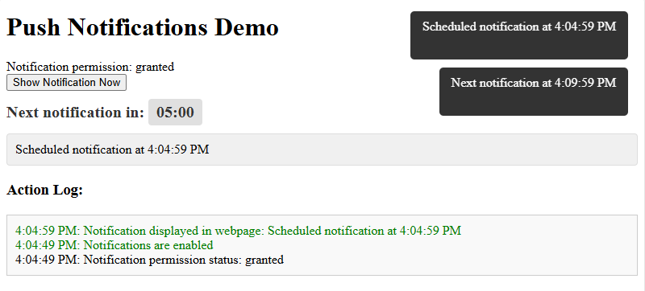
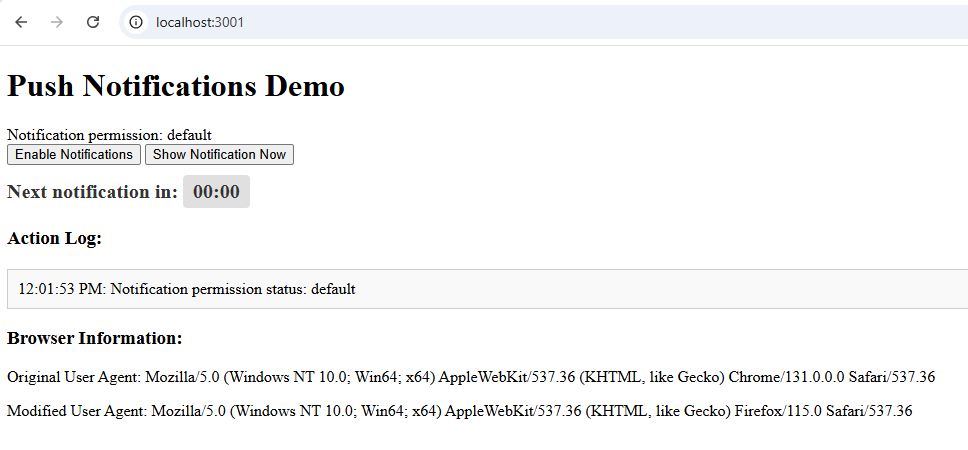

### push_notifications_nodejs

- simple push notification with manual and countdown notification and tooltip
- use these commands:
  ```aiignore
  npm init -y

  npm install http fs path

  node --version

  push_notifications_nodejs>npm start 

  ```
  
### Result is:
  ```aiignore
  
    > push_notifications_nodejs@1.0.0 start
    > node server.js
    
    Server running at http://localhost:3001
  
  ```



test of changes on layer applications with javascript ! ~ !


